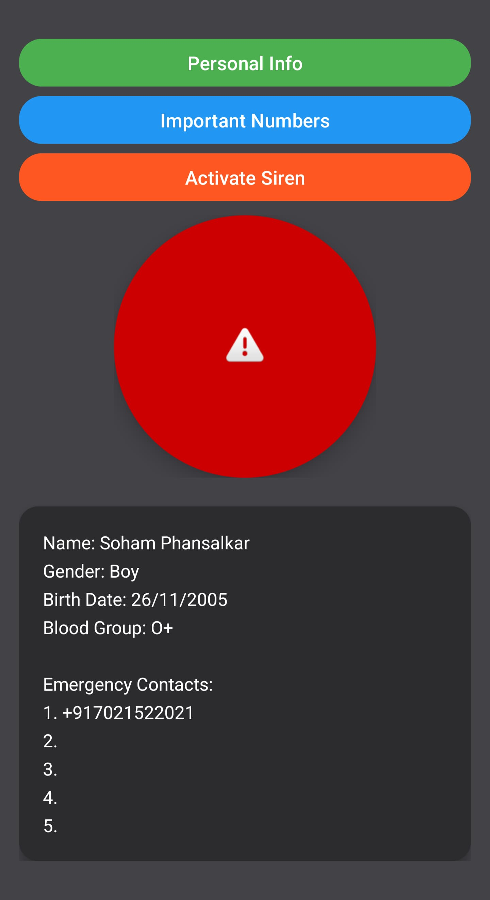
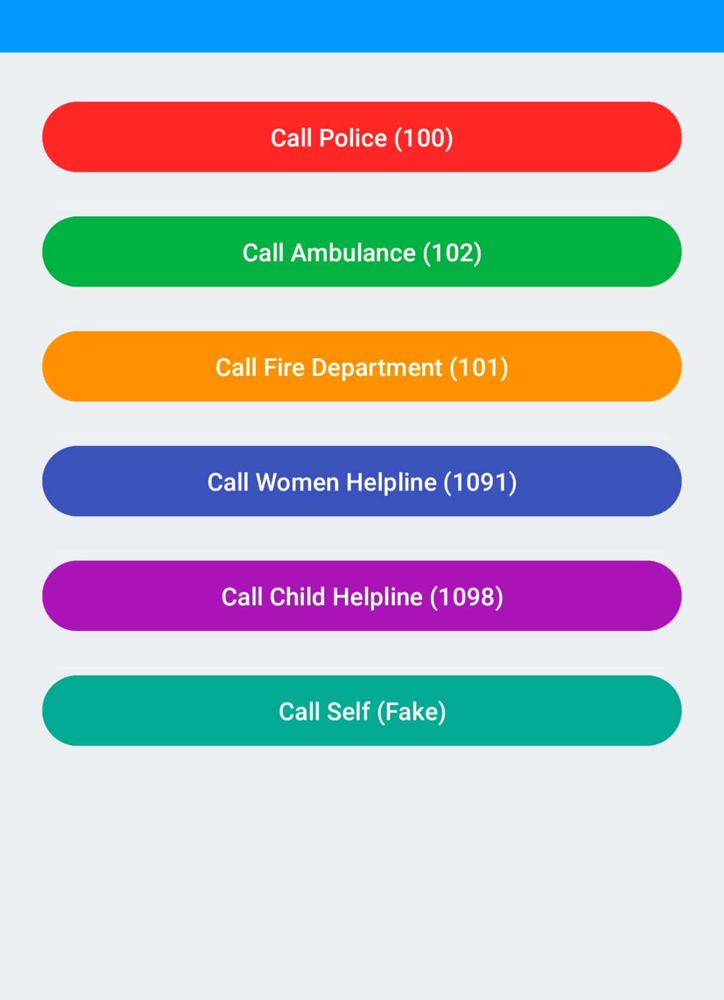

# 🛡️ Safety App – Emergency Location & Contact Alert System

> "Built to protect. Designed for speed. Developed with purpose."

An Android emergency alert application that sends your live **GPS location** to **saved emergency contacts** via **WhatsApp** and **SMS**, while opening the dialer with emergency number **100** pre-filled.

---

## 🚨 Features

- 📍 Sends current GPS location as Google Maps link
- 👤 Stores personal details (name, gender, blood group, etc.)
- 📱 Allows saving multiple emergency contacts
- 🟢 Sends alerts via:
  - 📲 WhatsApp (auto-fills message)
  - ✉️ SMS (tested partially)
  - ☎️ Opens dialer with `100`
- 🏠 Home screen with emergency "Alert" button
- 🔐 Data stored securely using `SharedPreferences`
- 📡 Works with Android 10+ (targeted)

---

## 🖼️ Screenshots

> 🏠 **Home Screen**
>
> 

> 📒 **Emergency Info / Saved Numbers Screen**
> 
>

### 📦 Prerequisites

- Android Studio (Electric Eel or newer)
- JDK 11+
- Gradle 8+
- Android SDK 30+ (Target: Android 10+)

### ▶️ Steps

```bash
1. Clone the repo or download ZIP
2. Open in Android Studio
3. Run on emulator or connected Android 10+ device
4. Grant permissions when prompted:
   - Location Access
   - SMS / WhatsApp (optional)
   ```

### 🛡️ Permissions Used
``ACCESS_FINE_LOCATION`` – to get live location

``SEND_SMS`` – to send alert messages (optional/manual)

``INTERNET`` – for WhatsApp

``CALL_PHONE`` – to open dialer

ℹ️ App does not auto-send SMS (Android 10+ limitations), but opens messaging and WhatsApp with message prefilled.
